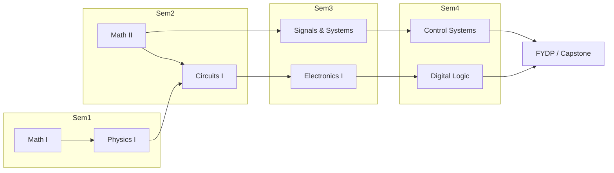

# SAR — Self-Assessment Report Template (Version 3.0)

Source: `documents/SAR_V_3.pdf` — ACC-TMP-04-04-V3.0, Board of Accreditation for Engineering and Technical Education (BAETE). This file reproduces **Criterion 1 through Criterion 9** and **Volume 2: Annexures** verbatim (including every sub-point and every table), with added visualization suggestions for the data-heavy parts of the template. No content has been shortened or reworded.

---

## Document Front Matter (context)

**Guidelines for preparing the SAR**

The completed SAR must describe how the institution and the program comply with the BAETE benchmark in each criterion.

The following points should be noted while preparing the SAR:

1. The data and the information provided in the SAR must be adequate and supplemented by comments and discussions that will allow the evaluation team to perform a preliminary evaluation of the program based on the SAR.
2. For any criteria and sub-criteria, the SAR is generally expected to address the following three questions with data, examples of cases and other supporting information to justify the assertions:
   a. Is there a policy/process in place?
   b. If 'yes', is the policy/process in practice?
   c. Does any improvement mechanism exist for the policy/process?
   The challenges faced and how these were overcome during the enactment, implementation and improvement of each policy and process should also be described.
3. The SAR must proactively and unambiguously identify the deviation from its policies where and when one exists.

**Supplemental Documents** — the following must be provided in the Annexure:

1. Latest copy of the prospectus and a copy of the latest academic calendar followed by the program under evaluation.
2. A copy of the approval letter from the appropriate authority to establish the institution.
3. Copy of the approval letter from the appropriate authority to establish the program.
4. Copy of statutes/academic ordinances or equivalent documents.

All other documents requested in the SAR template must be provided as annexures. **The SAR should not exceed 150 pages, excluding annexures.** The SAR must be submitted through the Online Accreditation Management System of BAETE (https://ams.baetebangladesh.org/). No hard copies are required.

The SAR document is organized as **Volume 1** (General Information, Eligibility, Criteria 1–9, Certificate of Compliance) and **Volume 2: Annexures**.

> 📊 **Visualization suggestion:** A single "SAR completeness tracker" dashboard — one row per Criterion (1–9) plus Annexures A–M, each with a status pill (Not started / In progress / Evidence attached / Complete). See the interactive mockup at the end of this document.

---

## Criterion 1: Program Educational Objectives

### 1.1 Mission and Vision Statement

- State the institution's vision and mission.
- State the vision and mission of the department/faculty/school offering the program.
- Indicate how the mission statements of the institution and the department are aligned.

### 1.2 Program Educational Objectives

- State the program educational objectives.
- Describe the process of establishing the program educational objectives and stakeholders consulted, including industry, during the development of PEOs.
- List the program stakeholders. Describe how the program educational objectives meet the needs of the program stakeholders (e.g., faculty members, alumni, and employers of the program's graduates).
- Indicate how the program educational objectives are published and disseminated to various stakeholders.
- Indicate how the program educational objectives are realistic within the context of available resources.

### 1.3 Consistency of the Program Educational Objectives with the Mission

Describe how the program educational objectives are consistent with the Mission of the Institution or Department offering the program.

### 1.4 Process for Measurement of Attainment of the Program Educational Objectives

- Describe the process of tracking the stakeholders (e.g., graduates and employers) and measuring the attainment of program educational objectives.
- Describe the assessment methods and tools, attainment criteria, etc., for each objective.
- Provide a summary of PEO attainment results. Include evidence and documents in the Annexure.

> Provide the documentation supporting the claims under Criterion 1 in **Annexure C**.

> 📊 **Visualization suggestion:** A "PEO Alignment Map" — Sankey/flow diagram linking Institution Mission → Department Mission → each PEO → Stakeholder groups consulted. A separate horizontal bar chart for "PEO attainment %" per PEO, trended year-over-year (see mockup 2 below).

---

## Criterion 2: Program Outcomes and Assessment

### 2.1 Program Outcomes (PO)

- State the Program Outcomes.
- Describe the process of defining the Program Outcome. Provide evidence and supporting documents.

### 2.2 Equivalence of the Program Outcomes

Indicate how the Outcomes set by the Program are substantially equivalent to the twelve graduate attributes or Program Outcomes of BAETE. If the program outcomes are stated differently, map program outcomes with the outcomes provided in the BAETE accreditation criteria.

### 2.3 Course Outcomes (CO)

State the course outcomes for each course the program uses to demonstrate the attainment of program outcomes.

**Table 2.2.1. Course outcomes, teaching-learning and assessment methods**

| CO No. | CO statement | Corresponding PO | Teaching-learning methods | Assessment methods |
| :--- | :--- | :--- | :--- | :--- |
| *(to be filled by program)* | | | | |

### 2.4 Assessment of Course Outcomes

Describe how the attainment of COs is assessed in each course, including the rubrics, where applicable. The assessment processes, attainment criteria and scale, and expected level of attainment should be clearly stated. Present a summarized assessment of the COs of the courses listed in Table 2.2.1. Evidence of CO assessments for the other courses offered by the department for the program should be included in the Annexure.

### 2.5 Documentation on Teaching-learning and Assessment and CO Attainment

Describe how the program keeps documentation, including lecture plans, COs, course content, books, grading policy, assessment tools and samples of corresponding student works, and assessment of CO attainment.

### 2.6 Monitoring of Students' Academic Performance

Describe the process for monitoring students' academic performance and indicate how the process is supporting the achievement of outcomes.

### 2.7 Attainment of Program Outcomes

Provide a summary of the results of attainment of program outcomes for the most recent graduating cohort, whose attainment of program outcomes was measured. If transfer students are in the program, the attainment of their program outcomes must be demonstrated separately.

If the program uses final-year design projects, capstone projects, or other courses with substantial design components, list those projects' titles, including the supervisor's name(s) and group sizes.

#### 2.7.1 Attainment of PO1 or its equivalent
Describe how the attainment of PO1 is assessed and evaluated. State and justify the methods, tools, criteria and scale used in the assessment process. State the expected level of attainment. State how Knowledge Profile attributes (WK1 – WK4) are incorporated in PO1. Identify which attributes of the Range of Complex Engineering Problems (WP1 – WP7) are addressed through the attainment of PO1 and provide evidence to support the assertion. Present a summary of the results obtained after the assessment and analysis to demonstrate the extent to which PO1 is being attained.

#### 2.7.2 Attainment of PO2 or its equivalent
Describe how the attainment of PO2 is assessed and evaluated. State and justify the methods, tools, criteria and scale used in the assessment process. State the expected level of attainment. State how Knowledge Profile attributes (WK1 – WK4) and UN sustainable development goals are incorporated in PO2. Identify which attributes of the Range of Complex Engineering Problems (WP1 – WP7) are addressed through the attainment of PO2 and provide evidence to support the assertion. Present a summary of the results obtained after the assessment and analysis to demonstrate the extent to which PO2 is being attained.

#### 2.7.3 Attainment of PO3 or its equivalent
Describe how the attainment of PO3 is assessed and evaluated. State and justify the methods, tools, criteria and scale used in the assessment process. State the expected level of attainment. State how Knowledge Profile attribute WK5 is incorporated in PO3. Identify which attributes of the Range of Complex Engineering Problems (WP1 – WP7) are addressed through the attainment of PO3 and provide evidence to support the assertion. Present a summary of the results obtained after the assessment and analysis to demonstrate the extent to which PO3 is being attained.

#### 2.7.4 Attainment of PO4 or its equivalent
Describe how the attainment of PO4 is assessed and evaluated. State and justify the methods, tools, criteria and scale used in the assessment process. State the expected level of attainment. State how Knowledge Profile attribute WK8 is incorporated in PO4. Identify which attributes of the Range of Complex Engineering Problems (WP1 – WP7) are addressed through the attainment of PO4 and provide evidence to support the assertion. Present a summary of the results obtained after the assessment and analysis to demonstrate the extent to which PO4 is being attained.

#### 2.7.5 Attainment of PO5 or its equivalent
Describe how the attainment of PO5 is assessed and evaluated. State and justify the methods, tools, criteria and scale used in the assessment process. State the expected level of attainment. State how Knowledge Profile attributes WK2 and WK6 are incorporated in PO5. Identify which attributes of the Range of Complex Engineering Problems (WP1 – WP7) are addressed through the attainment of PO5 and provide evidence to support the assertion. Present a summary of the results obtained after the assessment and analysis to demonstrate the extent to which PO5 is being attained.

#### 2.7.6 Attainment of PO6 or its equivalent
Describe how the attainment of PO6 is assessed and evaluated. State and justify the methods, tools, criteria and scale used in the assessment process. State the expected level of attainment. State how Knowledge Profile attributes WK1, WK5 and WK7 are incorporated in PO6. Identify which attributes of the Range of Complex Engineering Problems (WP1 – WP7) are addressed through the attainment of PO6 and provide evidence to support the assertion. Present a summary of the results obtained after the assessment and analysis to demonstrate the extent to which PO6 is being attained.

#### 2.7.7 Attainment of PO7 or its equivalent
Describe how the attainment of PO7 is assessed and evaluated. State and justify the methods, tools, criteria and scale used in the assessment process. State the expected level of attainment. State how Knowledge Profile attribute WK9 is incorporated in PO7. Present a summary of the results obtained after the assessment and analysis to demonstrate the extent to which PO7 is being attained.

#### 2.7.8 Attainment of PO8 or its equivalent
Describe how the attainment of PO8 is assessed and evaluated. State and justify the methods, tools, criteria and scale used in the assessment process. State the expected level of attainment. State how Knowledge Profile attribute WK9 is incorporated in PO8. Present a summary of the results obtained after the assessment and analysis to demonstrate the extent to which PO8 is being attained.

#### 2.7.9 Attainment of PO9 or its equivalent
Describe how the attainment of PO9 is assessed and evaluated. State and justify the methods, tools, criteria and scale used in the assessment process. Identify the expected level of attainment. Identify which attributes of the Range of Complex Engineering Activities (EA1 – EA5) are addressed through the attainment of PO9 and provide evidence to support the assertion. Present a summary of the results obtained after the assessment and analysis to demonstrate the extent to which PO9 is being attained.

#### 2.7.10 Attainment of PO10 or its equivalent
Describe how the attainment of PO10 is assessed and evaluated. State and justify the methods, tools, criteria and scale used in the assessment process. State the expected level of attainment. Present a summary of the results obtained after the assessment and analysis to demonstrate the extent to which PO10 is being attained.

#### 2.7.11 Attainment of PO11 or its equivalent
Describe how the attainment of PO11 is assessed and evaluated. State and justify the methods, tools, criteria and scale used in the assessment process. State how Knowledge Profile attribute WK8 is incorporated in PO11. State the expected level of attainment. Present a summary of the results obtained after the assessment and analysis to demonstrate the extent to which PO11 is being attained.

#### 2.7.12 Attainment of PO12 or its equivalent
Describe how the attainment of PO12 is assessed and evaluated. State and justify the methods, tools, criteria and scale used in the assessment process. State the expected level of attainment. Present a summary of the results obtained after the assessment and analysis to demonstrate the extent to which PO12 is being attained.

#### 2.6.13 Achievement of additional POs
*(numbered 2.6.13 in the source template)* Describe how the attainment of each additional PO (if any) is assessed and evaluated. State and justify the methods, tools, criteria and scale used in the assessment process. State the expected level of attainment for each of the additional POs. Present a summary of the results obtained after the assessment and analysis to demonstrate the extent to which each additional PO is being attained.

> Provide the documentation supporting the claims under Criterion 2 in **Annexure D**.

> 📊 **Visualization suggestion:** A 12-spoke **radar/spider chart** of PO attainment % (PO1–PO12) with a threshold ring at the program's defined attainment cut-off (e.g., 50%) — instantly shows which POs are weak. Pair with a **CO→PO mapping heatmap** (courses as rows, PO1–PO12 as columns, cell shaded by mapping strength C/P/A). See the interactive mockup below.

---

## Criterion 3: Curriculum and Teaching-Learning Processes

### 3.1 Program-specific Criteria

Describe how the program satisfies any applicable program criteria.

### 3.2 Breadth and Depth of the Curriculum

Indicate how the breadth and depth of the curriculum are appropriate for solving complex engineering problems.

### 3.3 Course Content

List all courses by subject categories. Subject categories may include engineering, mathematics, natural sciences, computing, humanities, social sciences and other non-engineering courses. Indicate whether these courses are Compulsory or Optional.

| Course no. and title | Credit hours | Contact hours | The last three terms where the course was offered | No. of students registered | Compulsory/Optional |
| :--- | :--- | :--- | :--- | :--- | :--- |
| **Subject category 1** | | | | | |
| Course 1 | | | | | |
| Course 2 | | | | | |
| … | | | | | |
| *Subcategory total* | | | | | |
| **Subject category 2** | | | | | |
| … | | | | | |

Justify the adequacy of the courses of each category and their contents for attaining program outcomes.

Also, submit the detailed content of each course the program offers, including credit hours, contact hours, prerequisites and a list of the textbooks and reference books in the Annexure. The format of the detailed course content is in **Annexure E** of this template.

### 3.4 Flow Chart

Submit a semester-by-semester flow chart or worksheet that depicts the prerequisite structure of the program's required courses.

### 3.5 Relation between Program Educational Objectives and Curriculum

Describe how the curriculum and teaching-learning process support the attainment of program educational objectives.

### 3.6 Relation between Course Outcomes and Program Outcomes

For each course, present a map of COs and POs. Alternatively, the following information may be presented graphically.

### 3.7 Knowledge Profile, Complex Engineering Problems, Complex Engineering Activities and UN-SDGs

Demonstrate, through mapping, how each attribute of the Knowledge Profile (WK1 – WK9) is addressed in the curriculum. Provide a list of courses where complex engineering problems are included in the teaching-learning and assessment processes. Justify how the problems meet the requirements of complex engineering problems. Additionally, demonstrate how Complex Engineering Activities are incorporated into teaching-learning and assessment. Also, demonstrate how various United Nations Sustainable Development Goals (UN-SDGs) are considered in the teaching, learning and assessment.

### 3.8 Teaching-learning and Assessment

Describe the teaching-learning methods and assessment tools used to address complex engineering problems and program outcomes. Indicate how the teaching-learning methods and assessment tools are effective and appropriate. Describe the process of designing and selecting appropriate assessment tools in different courses. Mention if there is any process (e.g., question moderation) to ensure the effectiveness and appropriateness of the assessment tools.

#### 3.8.1 Laboratory Activities
State how the program uses lab activities to support the attainment of program outcomes. Provide the list of experiments conducted in each lab course. Justify the appropriateness of the assessment tools used for lab activities.

#### 3.8.1 Culminating Course(s)
*(numbered 3.8.1 again in the source template — a duplicate section number)* Describe the process followed in the culminating course (e.g., final-year design project, capstone project) through which the program prepares its students for engineering practice through a major design experience based on the knowledge and attitudes acquired in earlier coursework and incorporating appropriate engineering standards and design constraints.

#### 3.8.2 Alternative Approach
If the program plans to prepare the students for engineering practice through any approach other than the final year design or capstone project courses, describe the process in detail, highlighting the appropriateness of the process.

> Provide the documentation supporting the claims under Criterion 3 in **Annexure F**.

> 📊 **Visualization suggestion:** A **curriculum prerequisite flow diagram** (Mermaid `graph LR`, semester-by-semester) satisfies §3.4 directly. A **WK1–WK9 × course matrix heatmap** and a stacked bar chart of credit-hour distribution by subject category (Engineering / Math / Natural Science / Computing / Humanities / Social Science) visualize §3.3 and §3.7 at a glance.

---

## Criterion 4: Interactions with the Industry

### 4.1 Process for Industry Participation in Curriculum Design and Review

Explain how industrial participation is ensured in establishing, updating, and improving the objectives, outcomes, and curriculum to make these relevant to the industry's needs.

If there is an industrial advisory panel, list the names, designations and professional qualifications of the members of the program/department's industrial advisory panel. Indicate how the IAP broadly covers all relevant industry representatives. Describe the IAP's role in the curriculum design and review.

If the alumni association exists, describe its role in the curriculum design and review.

Comment on the effectiveness and sustainability of the entire process.

### 4.2 Students' Opportunities to Gain Industrial Experience

- State whether the students in the program are required to perform an industrial internship. If yes, describe the nature and the duration of the internship. Explain how student performance during the internship is assessed.
- State whether the industry is engaged in final-year design projects or other design projects. If yes, provide details regarding the industry's involvement in selecting the project topic, supporting activities, and providing an assessment. Provide relevant evidence.
- State whether the students in the program are required to visit relevant industries. If yes, provide details regarding the nature of such visits. Explain how the industrial visit supports students gaining industrial exposure.
- State any other activities the program uses to provide students with the opportunity to obtain industrial experience. Provide relevant evidence.

> Provide the documentation supporting the claims under Criterion 4 in **Annexure G**.

> 📊 **Visualization suggestion:** A timeline/Gantt view of industry-touchpoints across the 4-year program (internship window, IAP meeting cadence, industrial visits, FYDP industry co-supervision) makes §4.2 easy to audit at a glance.

---

## Criterion 5: Continuous Quality Improvement

### 5.1 Quality Assurance System

Describe the quality assurance system that the program has under an institutional framework. Mention its organogram, the name and qualifications of the person occupying each position, the terms of reference of the system, the budget, and the activities conducted. Describe how the quality assurance system's activities support the program in continuous improvement.

### 5.2 Feedback on Student's Academic Performance

Describe the process of providing continuous feedback to students regarding their academic performance. Describe measures that are in place to help academically weaker students.

### 5.3 Stakeholders' Feedback

#### 5.3.1 Feedback from Students
Describe the process of collecting feedback from students. Indicate how the gathered feedback is used in continuous improvement.

#### 5.3.2 Feedback from Faculty Members
Describe the process of collecting feedback from Faculty Members. Indicate how the gathered feedback is used in continuous improvement.

#### 5.3.3 Feedback from Alumni
Describe the process of collecting feedback from program Alumni. Indicate how the gathered feedback is used in continuous improvement.

#### 5.3.4 Feedback from Employers
Describe the process of collecting feedback from the employers of the program graduates. Indicate how the gathered feedback is used in continuous improvement.

### 5.4 CQI Loops

#### 5.4.1 CQI Loop for PEO
- Describe the CQI processes for PEOs.
- Discuss how various stakeholders' evaluation results and feedback are systematically utilized to improve the PEOs continuously.
- Provide copies of documents (survey results, analysis reports, meeting minutes) to justify each statement.

#### 5.4.2 CQI Loop for PO
- Describe the CQI processes for POs. Discuss how the results of direct and indirect assessments, including feedback from various stakeholders, are systematically utilized to improve the PO attainments continuously.
- Provide copies of documents (survey results, assessment and analysis reports, meeting minutes, etc.) to justify each statement.

#### 5.4.3 CQI Loop for Courses and Curriculum
Describe the CQI processes for courses and curriculum. Discuss how various stakeholders' assessment results and feedback are systematically utilized to continuously improve the COs, their attainments, and the curriculum. To justify each statement, provide copies of documents (survey results, assessment and analysis reports, meeting minutes).

> Provide the documentation supporting the claims under Criterion 5 in **Annexure H**.

> 📊 **Visualization suggestion:** A **closed-loop CQI cycle diagram** (Feedback → Analysis → Action → Change → back to Feedback) for each of PEO / PO / Course-Curriculum, annotated with the actual cadence (e.g., "PEO: every 3 yrs", "PO: annually", "Course: every semester") turns this into an audit-ready visual.

---

## Criterion 6: Students

### 6.1 Policy for Student Admission

Describe the admission policy and process for admitting new students into the program (attach published brochures/guidelines and website address). Discuss if any exceptions are made to the admission policy in admitting students. Mention how the policy is disseminated publicly. State any preferences/priorities in admissions/quotas. In tabular form, provide the number of students admitted into the program for each semester/term of the last three academic years. Explain how the admission requirements ensure the selection of students who have the potential to attain the POs.

| Academic year | Calendar span (from–to) | Semester/Term I | Semester/Term II | Semester/Term III |
| :--- | :--- | :--- | :--- | :--- |
| | | | | |

### 6.2 Policy for Transfer Students

Describe the policy and process for accepting transfer students into the program (attach published brochures/guidelines and website address). Mention the process of determining the equivalence of transfer credits. Provide information on the transfer of students as in the following table for the last three academic years.

| Name and ID of the student | Year and Semester/Term of transfer | Number of transferred credits | Course titles | Name and location of the institution and name of the program from where credits were earned |
| :--- | :--- | :--- | :--- | :--- |
| | | | | |

### 6.3 Advising and Counseling

Describe the process of providing academic advising to the students. If each student is assigned a faculty member as a designated advisor, provide advisor information for the three most recent semesters/terms, as per the following table.

| Name of the faculty member | Designation | No. of advisees assigned |
| :--- | :--- | :--- |
| | | |

Discuss the nature of the advising activities with examples. State whether the advisors maintain advising files or any other records of advising. Describe in detail whether the department/institution provides professional and mental health counseling support to students in need. Describe in detail whether the department/institution provides career counseling and placement support to students. If international students are studying in the institution, discuss the nature of the designated support facility for the international students.

### 6.4 Extra- and Co-curricular Activities

State the policy of the institution/department, if any exists, regarding students' extra- and co-curricular activities. State how these activities are encouraged/supported institutionally and by the department. List students under the program who have participated in various extra- and co-curricular activities at the institutional level or higher in the past three academic years. Additionally, list notable achievements involving students from the program, if any. State the opportunities for the student to get involved in the activities of the relevant professional societies. Justify whether the students' workload enables them to participate in extra and co-curricular activities.

> Provide the documentation supporting the claims under Criterion 6 in **Annexure I**.

> 📊 **Visualization suggestion:** A stacked column chart of admissions by semester/term across three academic years (§6.1), plus a simple bar chart of student-to-advisor ratio per faculty advisor (§6.3) to flag overload.

---

## Criterion 7: Faculty

### 7.1 Full-time Faculty Members

Provide a list of full-time faculty members teaching in the program for each semester of the last academic year, as per the following table. Please include similar lists for the previous two academic years in the Annexure. State whether the program has sufficient qualified faculty members with relevant areas of specialization to teach all the courses offered.

| Name | Designation | Area of specialization | Highest academic degree | Years of experience – Teaching | Years of experience – Industrial (if any) | Date of joining this institution | Total weekly teaching load (in hours) |
| :--- | :--- | :--- | :--- | :--- | :--- | :--- | :--- |
| | | | | | | | |

Additionally, provide detailed curriculum vitae for each faculty member in the Annexure. The format of the faculty curriculum vitae is given in **Annexure J** of this template.

### 7.2 Part-time Faculty Members

Provide a list of part-time faculty members teaching in the program for each semester during the last academic year, as per the following table. Please include similar lists for the previous two years in the Annexure.

| Name | Designation | Area of specialization | Highest academic degree | Years of experience – Teaching | Years of experience – Industrial (if any) | Total weekly teaching load (in hours) |
| :--- | :--- | :--- | :--- | :--- | :--- | :--- |
| | | | | | | |

Additionally, provide detailed curriculum vitae in the Annexure for each faculty member. The format of the faculty curriculum vitae is given in **Annexure J** of this template.

### 7.3 Class Size

State the minimum class size (number of students), the maximum class size and the average class size of all the courses/sections offered by the program for each semester during the last three academic years. State whether the class size suits teaching-learning and assessment activities to achieve all the course outcomes. In the Annexure, provide a list of all the courses/sections offered by the program, including the class size and the instructor's name, for each semester during the last three academic years.

### 7.4 Student-teacher Ratio

Calculate the student-teacher ratio of the program for each semester during the last three academic years. Describe in detail the calculation procedure and justify the appropriateness of the adopted calculation model. State whether the student-teacher ratio is suitable for conducting the teaching-learning and assessment activities to achieve all the course outcomes and for adequate interactions between teachers and students outside of class.

### 7.5 Role of Faculty Members in Coordinating and Improving the Courses

Describe in detail the role of the faculty members in establishing course outcomes, selecting appropriate pedagogical and assessment tools, updating course content, and making decisions regarding quality improvements to the program. Attach copies of the minutes of relevant meetings held during the last three academic years in the Annexure to support this assertion.

### 7.6 Professional Development

Summarize to what extent the faculty members are engaged in research, development, and professional activities that promote the attainment of the institutional mission and vision and how students benefit from these activities. The institutional support provided to the faculty members to further enhance academic and professional development should also be mentioned.

Complete the following table for the full-time faculty members in service in the current semester.

| Name | Designation | No. of journal/conference papers published in the last three years | No. of consulting positions during the last three years | List of professional society activities in the last one year |
| :--- | :--- | :--- | :--- | :--- |
| | | | | |

### 7.7 Training of Faculty Members on Outcome-based Education

Provide data on faculty members' training on outcome-based education. Justify how the activities conducted by the program/institutions are adequate for the faculty members to train them in establishing appropriate course outcomes, conducting effective teaching-learning activities, conducting suitable assessments, and measuring outcome achievement.

> Provide the documentation supporting the claims under Criterion 7 in **Annexure K** *(the source template's footer for this section says "Criterion 5" — likely a template typo; the annexure letter K is explicitly assigned to Criterion 7 in the Table of Annexures).*

> 📊 **Visualization suggestion:** A trend line of student-teacher ratio across the last 6 semesters (§7.4) against a BAETE-acceptable band; a pyramid/age-distribution chart of senior vs. junior faculty (§ full-time roster) to visualize the "good blend of senior and junior faculty" requirement referenced in Criterion 5.7 of the Accreditation Criteria.

---

## Criterion 8: Governance, Finance and Safety

### 8.1 Background Information

Describe in no more than 300 words the institution's background and the program under evaluation.

### 8.2 Organizational Structure

Provide an up-to-date organogram of the institution.

### 8.3 Statutory Positions and Bodies of the Institution

#### 8.3.1 Appointment of Statutory Positions
State the process for appointing the following key statutory positions or equivalent as per the applicable Act/Ordinance/Statute/Rule of the institution:

| Appointment of | Appointing/approving authority | Date and period of appointment | Reference to clause/section/article of Act/Statute/Rule* |
| :--- | :--- | :--- | :--- |
| Vice Chancellor | | | |
| Pro-Vice Chancellor | | | |
| Treasurer | | | |
| … | | | |

*Refer to any published documents other than acts/statutes/rules if necessary.*

#### 8.3.2 Formation and Function of the Statutory Bodies
For the syndicate, the academic council, the finance committee, the faculty selection committee, the disciplinary committee, and any other statutory committee, state the committee's assigned responsibility (as per act/ordinance/statutes). Prepare a table for each committee as follows.

| Name and affiliation of member | Membership capacity | From – to |
| :--- | :--- | :--- |
| | | |

Comment briefly on the alignment of the actual activities of each committee with the assigned responsibilities.

List the meeting date(s) of each statutory body during the last calendar year. Attach a copy of each committee's most recent meeting notice in the Annexure. Also, please fill out the following table.

| Committee name | Reference to meeting notices in Annexure |
| :--- | :--- |
| | |

#### 8.3.3 Formation and Function of the Management Committees
Institutions often form committees in addition to statutory bodies for the smoother running of academic and administrative activities. For each such committee, state the committee's assigned responsibility. Prepare a table for each committee as follows.

| Name and affiliation of member | Membership capacity | From – to |
| :--- | :--- | :--- |
| | | |

Comment briefly on the alignment of the actual activities of each committee with the assigned responsibilities.

List the meeting date(s) of each management committee during the last calendar year. Attach a copy of each committee's most recent meeting notice in the Annexure. Also, please fill out the following table.

| Committee Name | Reference to meeting notices in Annexure |
| :--- | :--- |
| | |

### 8.4 Existence of and Adherence to Policies

#### 8.4.1 Documented Policies
Provide a list of policies in practice in the Institution. Provide copies of the statutes, the ordinances and any other relevant policies such as service rules, academic rules, codes of conduct, disciplinary rules, recruitment and promotion policies, salary structure, leave rules, grievance redressal, and scholarship and financial aid policies for students and employees in the Annexure. Describe how each of these policies is disseminated to the stakeholders. Also, discuss how these policies foster social responsibility, diversity and inclusivity.

#### 8.4.2 Adherence to Policies
Describe the extent to which the policies are adhered to when making academic and administrative decisions. The process for making exceptions, if any exist, should be outlined. Additionally, list the cases of exception requests received in the last academic years and indicate the instances in which exceptions were made. Discuss how the effectiveness of the policies is evaluated and the processes followed to update a policy. Give relevant examples, where applicable, to justify assertions.

### 8.5 Finance and Budget

#### 8.5.1 Assets Commensurate with Revenue
Complete the following table for the last three calendar years.

| Information about the Institution | Year 1 | Year 2 | Year 3 |
| :--- | :--- | :--- | :--- |
| Total income (BDT) | | | |
| Total capital investment (BDT) | | | |
| Total operational expenditure (BDT) | | | |
| Total asset (BDT) | | | |

#### 8.5.2 Adequacy of Budget
State the amount budgeted, the actual expenditure in BDT, and the percentage of the total amount for the following sectors for the last three calendar years. In case of shared budgetary allocation and expenditure, identify that sector(s) from the following:

- Salary of the faculty members of the institution and the program under evaluation
- Salary of the non-teaching staff of the institution and the program under evaluation
- Scholarships and financial aid disbursed to students of the institution of the program under evaluation, including the number of students receiving the support
- Laboratories of the institution and the program under evaluation
- Physical infrastructure (space, furniture, air conditioners)
- Information Technology (IT)
- Maintenance
- Medical center
- Co-curricular and extra-curricular activities
- Student affairs support and placement facilities
- Library

Briefly discuss whether the budgeted amounts are adequate for the proper running of the program under evaluation. If they are not, indicate the sectors where inadequacy exists. Identify what measures are being taken to address the inadequacies.

#### 8.5.3 Appropriateness of Budgetary Allocation
Describe the budgetary planning process, identifying priority areas and resource allocation. Additionally, describe the general process of preparing and approving the budget, including feedback from the stakeholders.

### 8.6 Safety Plan and its Implementation

#### 8.6.1 Safety Plan
Describe the institution's safety plan that addresses risk from manmade or natural hazards, including fire detection and suppression and incident and accident management in the laboratories. Indicate whether the institution has considered any other hazard in its safety plan (e.g., earthquake, injury, personal safety, specific needs (disability), etc.). For the emergency procedure and services, provide the following information:

- A list of emergency contacts: whom to call for support (e.g., fire/police/ambulance, campus security, first-aider)
- Information on emergency management team: who plays what role during an emergency
- Evacuation procedure: includes floor plans with detailed locations of emergency exits, evacuation routes, and safety equipment
- Emergency procedure: includes who should be contacted, at what stages, and the best means of contact; where to find emergency kits, first aid officers and supplies and instructions; if possible, scenario-based solution for emergencies
- After emergency procedure: steps to be taken immediately after an emergency has occurred — whom to notify, how to notify and when to notify
- Test procedure for emergency plan: evacuation drills, fire drills, etc.

Provide details on what measures the institution is taking to make the campus safe, including training on mandatory safety requirements, risk management procedures, safe work instructions, etc.

#### 8.6.2 Fire Detection and Suppression Systems
Provide details on the following to justify the adequacy of the safety plan in managing fire safety:

- Existing fire detection and suppression system
- Means of escape – exits, signs and illumination
- Human resources – list of trained personnel with details on their training
- Inspection, testing and maintenance procedures of fire suppression systems
- Records of fire drills and evacuation drills

Indicate how the existing fire detection and suppression systems are adequate to make the campus safe.

#### 8.6.3 Laboratory Safety
Provide the laboratory safety documentation. It may be a common document for all laboratories, or laboratories may have it individually. The safety documentation must indicate the following:

- Defined authority, roles and responsibilities of staff and students
- Laboratory Safety Guidelines
- Location of laboratory safety systems & equipment
- Induction and training procedure for students and staff
- Risk assessment of laboratory works
- Safe work instructions for experimentation or other lab works
- Emergency process in place
- Incident reporting process
- Addressing radiation, bio and chemical hazards (when applicable)

> Provide the documentation supporting the claims under Criterion 8 in **Annexure L** *(source template footer again reads "Criterion 5" here — a repeated template typo; Annexure L is explicitly mapped to Criterion 8 in the Table of Annexures).*

> 📊 **Visualization suggestion:** A 3-year grouped bar chart of budgeted vs. actual spend per sector (§8.5.2) with a "% of total" secondary axis; a simple floor-plan style evacuation-route diagram for §8.6.1; an organogram (org-chart) diagram for §8.2.

---

## Criterion 9: Academic Facilities and Technical Support

### 9.1 Library

#### 9.1.1 Space and Hours of Operation
State the total space allocated for the library and the number of students served by the library. State the library's operating hours.

#### 9.1.2 Library Resources
In the following table, provide information on books, journals, proceedings, and other resources related to the institution and the program. Justify whether these resources are adequate for the program's students and faculty members.

| Category | No. of titles (applicable for the whole institution) | No. of titles (applicable for the program) |
| :--- | :--- | :--- |
| Books (hard copy) | | |
| Books (electronic) | | |
| Journals (hard copy) | | |
| Journals (electronic) | | |
| Proceedings (hard copy) | | |
| Proceedings (electronic) | | |
| Others | | |

Describe how IT and other modern technologies have influenced the library's use, operation and record-keeping for users and library officials.

### 9.2 Classrooms

Describe the number, usage, and facilities of classrooms available for the program. Justify whether these resources are adequate for the program.

### 9.3 Laboratories and Equipment

#### 9.3.1 Laboratories for all Relevant Courses of the Curriculum
List all the laboratory courses and the corresponding names and locations of the laboratories where the classes are conducted. Prepare a table for each semester of the last academic year.

| Serial number | Course no. and name | Laboratory name | Location of the lab (campus/building/floor/room #) |
| :--- | :--- | :--- | :--- |
| | | | |

#### 9.3.2 Availability of Equipment
For each laboratory, prepare a table using the following format.

*Name of the laboratory:* ___________

| Serial number | Name of the equipment | Quantity | Date and cost of purchase | Present condition |
| :--- | :--- | :--- | :--- | :--- |
| | | | | |

#### 9.3.3 Full-time Technical Support Staff for Laboratories
For each laboratory, list the full-time technical support personnel according to the following table.

| Name of laboratory | Name of person | Designation | Qualification (education, training) | Experience (years) |
| :--- | :--- | :--- | :--- | :--- |
| | | | | |

#### 9.3.4 Improvements of Laboratory Facilities
Describe the improvements made in the program's laboratories during the last three academic years. Describe the plans currently under consideration for laboratory improvement.

### 9.4 Internet and Computing Facilities

List the Internet facilities available for students and faculty members. Required information includes the number of computers with Internet connections, total bandwidth, areas covered by Wi-Fi, various hardware and software tools, daily available services, remote accessibility, etc.

List the number of laboratories, including the number of computers accessible to students outside of class/lab times. Identify the types of uses that are available to students. Computers in the library or any other commonplace may be considered if such facilities are available.

Justify the adequacy of the internet and computing facilities for the staff and students.

> Provide the documentation supporting the claims under Criterion 9 in **Annexure M** *(source template footer reads "Criterion 5" here as well — a repeated template typo; Annexure M is explicitly mapped to Criterion 9 in the Table of Annexures).*

> 📊 **Visualization suggestion:** A donut chart of library resource composition (hard-copy vs. electronic, books vs. journals vs. proceedings) for §9.1.2; a lab-equipment "age & condition" scatter/bubble chart (purchase year vs. condition, bubble size = quantity) for §9.3.2; a coverage map/heatmap for Wi-Fi/computing availability across campus buildings for §9.4.

---

## Certificate of Compliance

By signing below, we certify that all the information given in this Self-Assessment Report (SAR) for the accreditation of the __________________ (Name of program) is correct to the best of our knowledge.

It is also attested that this report is prepared in compliance with the BAETE Accreditation Manual for Undergraduate Engineering Programs.

| | |
| :--- | :--- |
| _____________________________ Name of the Head of the Department | _____________________________ Name of the Head of the Institution |
| _____________________________ Signature | _____________________________ Signature |
| _____________________________ Date | _____________________________ Date |

---

## Volume 2: Annexures

**Annexure A: Document related to Eligibility Criteria**
Provide documents relating to the program's eligibility criteria, including approval documents, a calculation showing the program meets the minimum credit hours required by BAETE and certificates of transcripts of all undergraduate programs offered by the Department/School.

**Annexure B: Certificate and Statement from BAETE (For Renewal Only)**
Provide the recent accreditation certificate and final statement received from BAETE.

**Annexure C: Documents related to Criterion 1**
Provide all documents required to support the chapter's content relating to Criterion 1.

**Annexure D: Documents related to Criterion 2**
Provide all documents required to support the chapter's content relating to Criterion 2.

**Annexure E: Course Content**
The detailed content of each course the program offers should be included in the Annexure as directed in Section 3.3 of the SAR template.

Please use the following format to prepare the course syllabi for each program's course:
1. Course number and title
2. Credit hours
3. Contact hours
4. Course Prerequisites
5. Course Instructor/coordinator
6. Brief description of the course contents
7. List of Text/Reference books including title, author, edition, publisher and year

**Annexure F: Documents related to Criterion 3**
Provide all documents required, in addition to those provided in Annexure E, to support the chapter's content relating to Criterion 3.

**Annexure G: Documents related to Criterion 4**
Provide all documents required to support the chapter's content relating to Criterion 4.

**Annexure H: Documents related to Criterion 5**
Provide all documents required to support the chapter's content relating to Criterion 5.

**Annexure I: Documents related to Criterion 6**
Provide all documents required to support the chapter's content relating to Criterion 6.

**Annexure J: Faculty Curriculum Vitae**
The curriculum vitae of the faculty members should be included in the Annexure as directed in sections 7.1 and 7.2 of the SAR template.

Please use the following format to prepare the curriculum vitae (maximum two pages) for each faculty member under the program:
1. Name
2. Designation
3. Educational qualification (start from highest) – degree, discipline, institution, year
4. Academic experience (most recent first) – institution, designation, period (mm/yyyy–mm/yyyy), type (full-time or part-time)
5. Non-academic experience (research, industrial) – organization, title/position, period (mm/yyyy–mm/yyyy), type (full-time or part-time)
6. Fellowship/membership of academic bodies and professional organizations
7. Honors and awards
8. List of significant publications and presentations in the five most recent years – title, names of the author(s), name of the journal/conference where published/presented, month and year of publication or presentation
9. List of Professional Consultancy and Sponsored Research activities in the five most recent years – organization, the title of the consultancy/research project, the amount received, if any, year

**Annexure K: Documents related to Criterion 7**
Provide all documents required, in addition to those provided in Annexure J, to support the chapter's content relating to Criterion 7.

**Annexure L: Documents related to Criterion 8**
Provide all documents required to support the chapter's content relating to Criterion 8.

**Annexure M: Documents related to Criterion 9**
Provide all documents required to support the chapter's content relating to Criterion 9.

---

## Visualization Mockups (ready-to-embed)

The following are working code snippets — drop-in visual companions for the SAR sections above. They use only vanilla HTML/CSS/SVG (or Chart.js via CDN) so they can be embedded directly into the training-hub site or exported as standalone previews.

### Mockup 1 — SAR Completeness Tracker (per Criterion + Annexure)

```html
<div style="font-family:system-ui,sans-serif;max-width:640px">
  <style>
    .sar-row{display:flex;align-items:center;gap:12px;padding:6px 0;border-bottom:1px solid #eee}
    .sar-name{flex:1;font-size:14px}
    .sar-pill{font-size:12px;padding:2px 10px;border-radius:999px;color:#fff;min-width:110px;text-align:center}
    .st-done{background:#16a34a}.st-progress{background:#d97706}.st-evidence{background:#2563eb}.st-todo{background:#9ca3af}
  </style>
  <div class="sar-row"><div class="sar-name">Criterion 1 — PEOs</div><div class="sar-pill st-done">Complete</div></div>
  <div class="sar-row"><div class="sar-name">Criterion 2 — POs & Assessment</div><div class="sar-pill st-progress">In progress</div></div>
  <div class="sar-row"><div class="sar-name">Criterion 3 — Curriculum</div><div class="sar-pill st-evidence">Evidence attached</div></div>
  <div class="sar-row"><div class="sar-name">Criterion 4 — Industry</div><div class="sar-pill st-todo">Not started</div></div>
  <div class="sar-row"><div class="sar-name">Criterion 5 — CQI</div><div class="sar-pill st-progress">In progress</div></div>
  <div class="sar-row"><div class="sar-name">Criterion 6 — Students</div><div class="sar-pill st-done">Complete</div></div>
  <div class="sar-row"><div class="sar-name">Criterion 7 — Faculty</div><div class="sar-pill st-todo">Not started</div></div>
  <div class="sar-row"><div class="sar-name">Criterion 8 — Governance/Finance/Safety</div><div class="sar-pill st-todo">Not started</div></div>
  <div class="sar-row"><div class="sar-name">Criterion 9 — Facilities</div><div class="sar-pill st-evidence">Evidence attached</div></div>
  <div class="sar-row"><div class="sar-name">Annexures A–M</div><div class="sar-pill st-progress">In progress</div></div>
</div>
```

### Mockup 2 — PO Attainment Radar Chart (Criterion 2 / §2.7)

```html
<canvas id="poRadar" width="480" height="480"></canvas>
<script src="https://cdnjs.cloudflare.com/ajax/libs/Chart.js/4.4.0/chart.umd.min.js"></script>
<script>
new Chart(document.getElementById('poRadar'), {
  type: 'radar',
  data: {
    labels: ['PO1','PO2','PO3','PO4','PO5','PO6','PO7','PO8','PO9','PO10','PO11','PO12'],
    datasets: [
      { label: 'Attainment %', data: [49,60,66,100,57,52,100,65,65,95,90,70], backgroundColor: 'rgba(37,99,235,0.2)', borderColor: '#2563eb' },
      { label: 'Threshold (50%)', data: Array(12).fill(50), borderColor: '#dc2626', borderDash: [6,4], pointRadius: 0 }
    ]
  },
  options: { scales: { r: { min: 0, max: 100 } } }
});
</script>
```

### Mockup 3 — CO→PO Mapping Heatmap (Criterion 2 / §2.3, §3.6)

```html
<div style="font-family:system-ui,sans-serif">
  <table style="border-collapse:collapse;font-size:12px">
    <tr><th></th><th>PO1</th><th>PO2</th><th>PO3</th><th>PO4</th><th>PO5</th><th>PO8</th><th>PO9</th></tr>
    <tr><td>CO1</td><td style="background:#1d4ed8;color:#fff">C</td><td></td><td></td><td></td><td></td><td></td><td></td></tr>
    <tr><td>CO2</td><td></td><td style="background:#1d4ed8;color:#fff">C</td><td></td><td></td><td></td><td></td><td></td></tr>
    <tr><td>CO3</td><td></td><td></td><td style="background:#1d4ed8;color:#fff">C</td><td></td><td style="background:#059669;color:#fff">P</td><td></td><td></td></tr>
    <tr><td>CO4</td><td></td><td></td><td></td><td></td><td style="background:#059669;color:#fff">P</td><td></td><td></td></tr>
    <tr><td>CO5</td><td></td><td></td><td></td><td></td><td></td><td style="background:#b45309;color:#fff">A</td><td style="background:#b45309;color:#fff">A</td></tr>
  </table>
  <p style="font-size:11px;color:#666">C = Cognitive · P = Psychomotor · A = Affective (mapping strength/domain)</p>
</div>
```

### Mockup 4 — CQI Closed-Loop Cycle (Criterion 5 / §5.4)

```html
<svg viewBox="0 0 420 420" xmlns="http://www.w3.org/2000/svg" style="max-width:360px">
  <defs><marker id="arrow" markerWidth="8" markerHeight="8" refX="6" refY="3" orient="auto"><path d="M0,0 L6,3 L0,6 z" fill="#2563eb"/></marker></defs>
  <circle cx="210" cy="210" r="150" fill="none" stroke="#e5e7eb" stroke-width="2"/>
  <g font-family="system-ui,sans-serif" font-size="13" fill="#1e293b">
    <circle cx="210" cy="60" r="40" fill="#dbeafe"/><text x="210" y="65" text-anchor="middle">Feedback</text>
    <circle cx="360" cy="210" r="40" fill="#dcfce7"/><text x="360" y="215" text-anchor="middle">Analysis</text>
    <circle cx="210" cy="360" r="40" fill="#fef3c7"/><text x="210" y="365" text-anchor="middle">Action</text>
    <circle cx="60" cy="210" r="40" fill="#fee2e2"/><text x="60" y="215" text-anchor="middle">Change</text>
  </g>
  <path d="M245,80 A150,150 0 0,1 340,175" fill="none" stroke="#2563eb" stroke-width="2" marker-end="url(#arrow)"/>
  <path d="M340,245 A150,150 0 0,1 245,340" fill="none" stroke="#2563eb" stroke-width="2" marker-end="url(#arrow)"/>
  <path d="M175,340 A150,150 0 0,1 80,245" fill="none" stroke="#2563eb" stroke-width="2" marker-end="url(#arrow)"/>
  <path d="M80,175 A150,150 0 0,1 175,80" fill="none" stroke="#2563eb" stroke-width="2" marker-end="url(#arrow)"/>
</svg>
```

### Mockup 5 — Curriculum Prerequisite Flow (Criterion 3 / §3.4) — Mermaid


